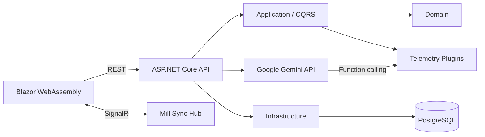

# Smart Mill Sync

Plataforma industrial em .NET 8 para sincronizar o recebimento de madeira no patio com o impacto energetico da fabrica. O sistema transforma dados de pesagem e umidade em indicadores operacionais, estima a necessidade adicional de Gas Natural (GN) e oferece diagnosticos assistidos por IA para cargas criticas.

## Para que serve

A madeira recebida pela fabrica apresenta variacoes relevantes de umidade. Quanto maior a umidade, menor o rendimento termico da biomassa e maior a necessidade de queima complementar de GN para manter a estabilidade do processo.

O Smart Mill Sync conecta esse contexto florestal ao processo industrial:

- registra cargas recebidas na portaria;
- normaliza e valida placa, origem, especie, pesos e umidade;
- calcula peso liquido e biomassa seca;
- estima o volume adicional de GN causado pela umidade;
- classifica alertas termicos;
- atualiza o painel em tempo real via SignalR;
- usa Gemini com function calling para consultar telemetria real e sugerir acoes operacionais;
- protege os endpoints com validacao, limites de payload, rate limiting, CORS restrito e JWT/OIDC em producao.

## Regras de negocio

A compensacao termica e exigida quando a umidade da carga ultrapassa 50%.

```text
Peso liquido = Peso bruto - Tara
Biomassa seca = Peso liquido * (1 - Umidade / 100)
GN adicional = (Umidade - 50) * 3,85 * Peso liquido
Custo estimado = GN adicional * Preco por Nm3
```

O preco padrao configurado para a simulacao e `R$ 2,50/Nm3`.

Exemplo validado no fluxo real:

```text
Peso liquido: 40 t
Umidade: 55%
Biomassa seca: 18 t
GN adicional: 770 Nm3
Custo estimado: R$ 1.925,00
Alerta: Alto
```

## Como foi desenvolvido

O projeto utiliza Clean Architecture e DDD para manter regras industriais isoladas de frameworks e detalhes externos.



### Camadas

| Projeto | Responsabilidade |
| --- | --- |
| `SmartMillSync.Domain` | Entidades ricas, invariantes, enums e calculos termicos. Nao depende de frameworks externos. |
| `SmartMillSync.Application` | Casos de uso CQRS, MediatR, FluentValidation, contratos e plugins do agente. |
| `SmartMillSync.Infrastructure` | EF Core, PostgreSQL, repositorios e worker de balanco termico. |
| `SmartMillSync.Shared` | DTOs e contratos compartilhados entre API e Blazor. |
| `SmartMillSync.Api` | Controllers REST, SignalR, Gemini, Swagger, seguranca e composicao de dependencias. |
| `SmartMillSync.Client` | Dashboard industrial em Blazor WebAssembly. |

### Fluxo de uma carga

1. O operador registra a chegada no Blazor.
2. A API valida o body e envia `RegisterWoodDeliveryCommand` pelo MediatR.
3. O dominio aplica invariantes e calcula peso liquido, biomassa seca e GN adicional.
4. O repositorio persiste a carga no PostgreSQL.
5. A API publica `DeliveryUpdated` pelo SignalR.
6. O dashboard atualiza tabela e KPIs sem refresh.
7. Em alertas altos, o operador pode solicitar um diagnostico Gemini.

## Agente industrial com Gemini

O Oraculo Industrial usa `gemini-3.1-flash-lite` e consulta apenas ferramentas C# autorizadas:

- `get_current_energy_balance`;
- `analyze_moisture_impact`;
- `get_high_moisture_deliveries`.

Os plugins usam dados reais da aplicacao. O modelo nao recebe acesso direto ao banco e nao pode executar funcoes arbitrarias. O loop de function calling preserva os metadados exigidos pelo Gemini 3, como `thoughtSignature` e `call_id`.

A resposta e renderizada em Markdown seguro no Blazor, com HTML desabilitado.

## Stack utilizada

### Backend

- C# 12;
- .NET 8;
- ASP.NET Core Web API;
- MediatR e CQRS;
- FluentValidation;
- Entity Framework Core;
- Npgsql e PostgreSQL;
- ASP.NET Core SignalR;
- BackgroundService e PeriodicTimer;
- Semantic Kernel Core;
- Google Gemini API.

### Frontend

- Blazor WebAssembly;
- SignalR Client;
- Markdig para Markdown seguro;
- CSS responsivo com visual industrial;
- componentes Razor testados com bUnit.

### Qualidade e operacao

- xUnit;
- NSubstitute;
- bUnit;
- Swagger / OpenAPI 3;
- Docker Compose;
- JWT Bearer / OIDC em producao;
- health checks, rate limiting, CSP e CORS allowlist.

## Estrutura do repositorio

```text
SmartMillSync/
|-- compose.yaml
|-- SmartMillSync.sln
|-- docs/
|   |-- deployment-security.md
|   `-- realtime-api.md
|-- src/
|   |-- SmartMillSync.Api/
|   |-- SmartMillSync.Application/
|   |-- SmartMillSync.Client/
|   |-- SmartMillSync.Domain/
|   |-- SmartMillSync.Infrastructure/
|   `-- SmartMillSync.Shared/
`-- tests/
    |-- SmartMillSync.Api.Tests/
    |-- SmartMillSync.Application.Tests/
    |-- SmartMillSync.Client.Tests/
    |-- SmartMillSync.Domain.Tests/
    |-- SmartMillSync.Infrastructure.Tests/
    `-- SmartMillSync.Shared.Tests/
```

## Pre-requisitos

- .NET SDK 8;
- Docker com Docker Compose;
- chave do Google AI Studio para usar o agente Gemini.

Confirme o SDK:

```bash
dotnet --version
```

## Como executar localmente

### 1. Inicie o PostgreSQL

```bash
docker compose up -d postgres
```

O Compose publica o banco somente em `127.0.0.1:5432`.

Confira o container:

```bash
docker compose ps
```

### 2. Configure a chave Gemini

Crie uma chave em [Google AI Studio](https://aistudio.google.com/apikey) e salve-a fora do repositorio:

```bash
dotnet user-secrets set "IndustrialAgent:ApiKey" "SUA_CHAVE" \
  --project src/SmartMillSync.Api/SmartMillSync.Api.csproj
```

A chave nao deve ser adicionada a `appsettings.json`, ao Blazor ou ao Git.

### 3. Inicie a API

```bash
ASPNETCORE_ENVIRONMENT=Development \
ASPNETCORE_URLS=http://localhost:5243 \
dotnet run --project src/SmartMillSync.Api/SmartMillSync.Api.csproj
```

Acesse:

- Swagger: [http://localhost:5243/swagger/index.html](http://localhost:5243/swagger/index.html)
- Liveness: [http://localhost:5243/health/live](http://localhost:5243/health/live)
- Readiness: [http://localhost:5243/health/ready](http://localhost:5243/health/ready)

### 4. Inicie o Blazor

Em outro terminal:

```bash
dotnet run --project src/SmartMillSync.Client/SmartMillSync.Client.csproj \
  --urls http://localhost:5080
```

Acesse [http://localhost:5080](http://localhost:5080).

## Endpoints principais

| Metodo | Rota | Descricao |
| --- | --- | --- |
| `POST` | `/api/v1/deliveries` | Registra uma carga de madeira. |
| `GET` | `/api/v1/deliveries` | Lista cargas ativas. |
| `GET` | `/api/v1/energy-balance` | Retorna o balanco energetico diario. |
| `POST` | `/api/v1/agent/chat` | Conversa com o agente industrial. |
| `POST` | `/api/v1/agent/diagnose-delivery/{id}` | Diagnostica uma carga ativa. |

O arquivo [`src/SmartMillSync.Api/SmartMillSync.Api.http`](src/SmartMillSync.Api/SmartMillSync.Api.http) contem exemplos prontos de requests.

## Seguranca

Em `Development`, JWT fica desabilitado explicitamente para permitir o Blazor local. Fora de Development, a API falha ao iniciar sem configuracao segura.

Protecoes implementadas:

- JWT Bearer / OIDC obrigatorio em producao;
- fallback policy para controllers e SignalR;
- CORS com origens exatas;
- rate limiting por usuario JWT ou IP;
- limite global e por endpoint para request bodies;
- validacao de mensagem, historico, enums e medicoes;
- `ProblemDetails` e `ValidationProblemDetails` sem stack trace;
- CSP, `X-Frame-Options`, `nosniff`, `no-referrer` e `no-store`;
- HSTS fora de Development;
- forwarded headers aceitos apenas de proxies configurados;
- Swagger somente em Development;
- PostgreSQL Docker restrito ao localhost.

A configuracao completa de producao esta em [`docs/deployment-security.md`](docs/deployment-security.md).

## Testes

Execute toda a suite:

```bash
dotnet test SmartMillSync.sln
```

O projeto possui mais de 130 testes cobrindo:

- invariantes e calculos do dominio;
- commands, queries e validators;
- mapeamentos e repositorios EF Core;
- worker termico;
- controllers, exception handling e SignalR;
- gateway Gemini e function calling;
- seguranca, CORS, rate limiting, payloads e health checks;
- contrato OpenAPI;
- componentes Blazor, responsividade e Markdown seguro.

Build final:

```bash
dotnet build SmartMillSync.sln --no-restore
```

## Decisoes tecnicas relevantes

- A logica estequiometrica permanece no dominio, nao nos controllers.
- O dominio nao referencia EF Core, MediatR ou ASP.NET Core.
- DTOs compartilhados evitam duplicacao entre API e Blazor.
- O Gemini consulta plugins permitidos em vez de inventar telemetria.
- A API usa `EnsureCreatedAsync` apenas em Development; producao deve aplicar migrations em uma etapa de deploy.
- Swagger documenta exemplos, limites, responses e contratos de erro.

## Demonstracao sugerida

1. Registre uma carga com `50 t` de peso bruto, `10 t` de tara e `55%` de umidade.
2. Observe `40 t` liquidas, `18 t` secas e `770 Nm3` de GN adicional.
3. Confirme o alerta critico no dashboard.
4. Clique em **Diagnosticar com IA**.
5. O agente consulta a telemetria, estima `R$ 1.925,00` e recomenda uma acao sujeita a validacao do operador.

---

O Smart Mill Sync demonstra uma aplicacao full stack em C# que conecta logistica florestal, eficiencia energetica, telemetria em tempo real, arquitetura corporativa e IA com dados operacionais controlados.
